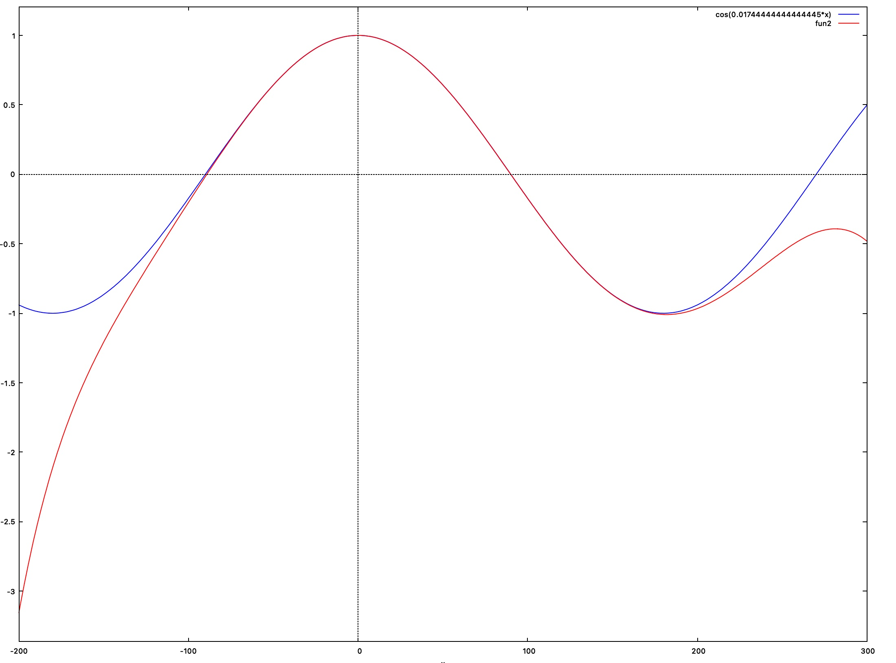

# Chebyshev approximation

Math functions are fast enough these days, but there are a couple of situations where a custom
approximation may give you the performance boost you need in the inner loop of your algorithm.

1. You can trade some accuracy for performance
2. You have a complex computation to carry on, and you can approximate the result, skipping a few steps

This is a starting point, and a tool I use for myself. You will need some pencil and paper later on
to expand the polynomial and happly the Horner's method on the results for an actual speedup.

Have a look at [the commented source](chebyshev.rb) and at the resulting implementation of the [cos](cos.rb)

For example the following plot compares the `cos` function and it's approximation computed in the range `[0, π/2]`

> happy hacking
>
> baol
